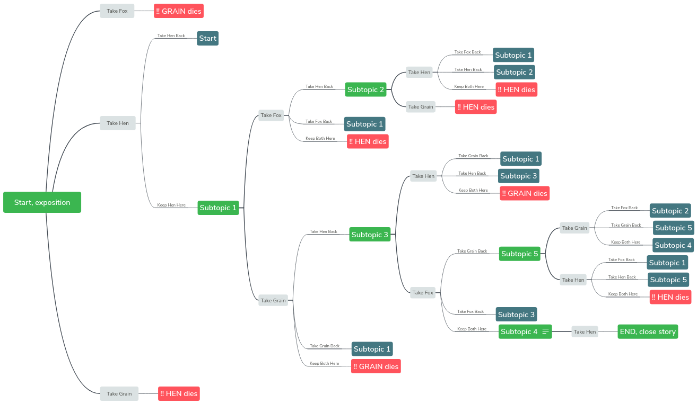

Designing a Visual Novel is complex. There are lots of places you could start from. I think a good start point is the goal of the story, and then the mechanics that will drive the story.

The game I am trying to design is about **friendship dynamics**. I vaguely remember a movie in which a scene seems to repeat itself, of the friends comming together at a party over many years and the friendship changing as they get to know each other's point of view. 

### The core game machanic ###

There are a lot of ways you could gamify the friendship. 

#### 1. Friends for Life ####

At first maybe, I thought the game could base around a some of the group of friends comming together at key events, have a brief conversation they then think about an absent member of the group. That leads you to make a choice about the absent member.

* Two friends A & B are together about to leave for University
* They think about one of the other 2 members of the group (C or D).
* You select to think about C.
* You then get to choose the major C chooses at Univesity.
* The story moves to the next phase, where C and A meetup by chance at Christmas.
* They discuss the first year at University, and then think about what B or D is doing.
* You select to think about D.
* Then get to make a choice of what D will do for Christmas, and so the story interates.

It would be a big complex game. That tells the development of the friends over 10 or 12 years. Some choices would lead you to not meet up with another member of the group for years, whilst others may have just a small step of time.
I like the idea of this life-long friendship dynamic game, because it is similar to how my friends and I from High School are. Some choices would cause closeness of friends (move into sharehouse together), whilst others would cause the group to fracture more and more (ie. choosing to move away overseas).

#### 2. Setting up Friends ####

The second mechanic idea, could be a night where all the friends are together. You have to make decisions for the group that causes the dynamic to change.
The game would progress through the night, and depending on the dynamic things would happen. I.e:
..* A girl would be attracted to A if he is being supported by friends, or 
... if you choose to support B she would be attracted to B. 
..* Maybe C would get drunk if A gets the girl, but 
... if B gets the girl then A will fight C.

This game could be controlled sort of like a simulator. Making it replayable, and depending on the story it could be controlled in scope.

#### 3. The Fox, Hen, Grain dynamic ####

Then I thought maybe we could keep the dynamic very simple. Make the game a horror game, with only 3 locations. You are a character, and you need to do some tasks and recruit the help of one of the other 3 characters.
* If you leave the Fox character with the Hen, then the Hen dies. 
* Or the Hen with the grain, the Grain dies.
* _This dynamic_ will be hidden from the player, instead the killing seems to be done by a monster, or the darkness.
* _Maybe_ this could get more complex by adding a serries of events, where the characters change roles, or having a more complex problem with 5 or more characters.

I liked this idea, because then it makes more of a reason for the game to have limited locations and to be looping. **The story:** could start at the end, so you know all 4 of your get out alive. Then if a character dies, the story needs to start from the top again (or from the last phase). 

```
Instead of death, maybe the characters could get into a very very big fight (that was simmering, so as to warn the player not to leave 2 angry players together), or a hospital visit, drug overdose or some other [adult fear](https://tvtropes.org/pmwiki/pmwiki.php/Main/AdultFear).
```


### Fleshing out the story ###

With a game mechanic in mind, you can figure out how to flesh out the story a bit easier. As you thought of your dynamic you were likely thinking of a case or two where the dynamic would work in the game. A diagram is best for this.

[]

