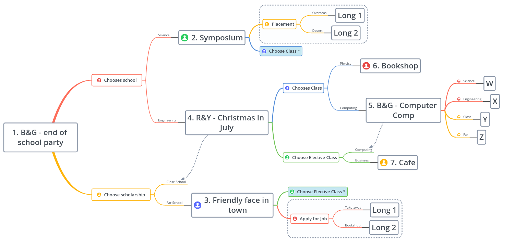
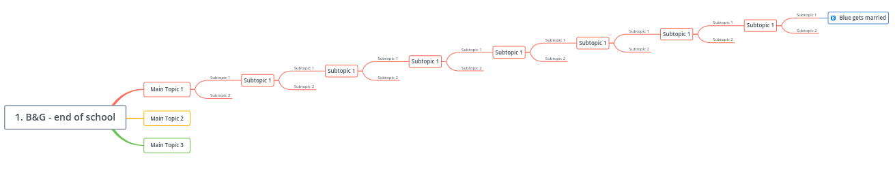
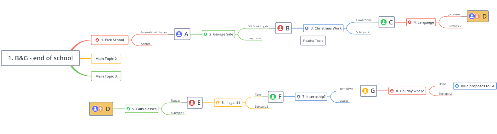

This is a game with a set of friends. Maybe 4 friends from High School, who catchup at times, creating a story.

Each section of the game has 2 friends catchup, explain what has happened since last meeting and then they think about one of the other friends. The player then gets to make decisions about what the other friend is doing, and progress the game to the next section, where the player and a friend catchup...

## The mechanic ##

There are 4 characters - Blue, Yellow, Green, Red (the primary colours, or sides of an [uckers board](http://www.uckers.co.uk/)).

I sketch up the flow of the story in [XMind](https://www.xmind.net), so I can see the scenes and the decisions that get to that scene. This allows the story to flow logally, and can help writing the game (by knowing branches and what is presumed to have occured).

## The scenes ##

From my draft decision tree I have 7 decisions and 2 stub scenes are 4 decisions to be thought of. I write a brief note for each scene in a list:

1. Blue and Green - end of school party.
   Blue explains he will be going away, Green explains he will study science.

2. Symposium
   Red and Green meet at a Science Symposium, discuss first semester of school studying science. 

3. Friendly face in town
   Yellow discovers Blue is at the rival Uni in his new town. They meet and it makes Yellow jealous of Blue's luck/wealth.

4. Red and Yellow - Christmas in July
   Red and Yellow meet at a Christmas in July. Red is looking for a part time job, Yellow going into desert for placement next semester.

5. Online Chat
   Blue and Green chat online, both are thinking of studying more IT. Depending on if Red and Yellow, different options are available for next step.

6. Bookshop (note Red may be Engineering or Science)
   Blue and Red meet at a bookshop, where Red works. Blue has started dating a girl in the physics class. __note this is a dead end__

7. Cafe (Note, Yellow may be close or Far)
   Green and Yellow meetup at a cafe, Yellow has started learning a language. Green wishes he had a part time job, to travel etc. __note this is a dead end__

* Long 1 -
   Red works at Take-away, Yellow Overseas. 2 years later they meet
* Long 2 -
   Yellow goes to Desert, Red works in Bookshop. 2 years later they meet.

__The following are decision points to be developed__
* W - a decision for scientist Red -- maybe he will decide if to apply for an internship.
* X - a decision for Engineer Red
* Y - a decision for Close School Yellow
* Z - a decision for Far School Yellow -- maybe a decision about running out of money and choosing what to forsake.

## Testing the decisions for continuity ##

Now with a handful of decisions, you can check and elaboate on the story. Make a character more jealous or down-troden than the rest, or add supporting characters, the new friends that as the game gets larger will have cameos in other story lines.

## Rather than starting at the begining ##

In many ways it is easier to plan a story knowing the end point. Rather than starting at the begining you could start the story arcs at the end. Decide where the story will end and then work back through the choices and scenes that tell the story to get to that point.

Maybe you decide each path should have 4-10 decisions, and that the _**good ending** is Blue's marriage_.

In [XMind](https://www.xmind.net) you start by drawing the critical path. The next step is to think of the decisions that got to the **good ending** and list them out. And the story between the decisions that will link the story.
A total of 8 decisions and 7 events (8 including the marriage proposal A-H):

1. Red chooses a school (he chooses International Studies)
* A. Red & Blue - Blue is studying Science,
2. Green has a garage sale (gifts books to girls)
* B. Green & Red - Red has got all DI & HD in classes.
3. Blue chooses Christmas Work (at flower shop)
* C. Blue & Green - Green introduces a girl from garage sale.
4. Red chooses a language (Japanese) 
* D. Red & Blue - Blue and the girl are dating.
5. Green fails 3 subjects (repeats)
* E. Green & Red - Red is about to apply for a job with shipping company.
6. Yellow is offered illegal $$ (take)
* F. Yellow & Green - Green is about to start his first day at company.
7. Blue is offered an internship (turn down)
* G. Blue & Yellow - Yellow loans Blue some cash, for something for his girlfriend.
8. Red decides where to spend holidays (fly home)
* H. Red & Blue - Blue proposes to his long term girlfriend

You probably can see that this type of game can get very broad. There could possibly be a dozens and dozens of endings. Also a lot of the written game will not be read in a single play through.

If you are not going to explore the other endings, you could make them all bad endings.

i.e.
* A. If you choose Science for Red, then he is killed in a Science explosion.* B. If Green Kept the Book, then he never meets any of the friends, grows old wondering.

But that would not make a very fun game.

## Look for chances to re-group branches ##

You should think of how some of the decisions do not have an effect on other characters, and take advantage of that to make common scenes.

You could rail road some of the story. If Blue works somewhere else, then Green still introduces the girl. But the text in Scene C references the other shop.

Maybe making the other choice shortens to the story to another ending.
Ie. Choosing Yellow, then  always offers a way to get to decision 6, but now Taking the illegal cash will give a bad ending - whilst not taking will get you to a good ending.

The more common scenes, or tightening of the branches you design the less you will have to write, design, and test.

## What next ?? ##

Once you have a rough outline, you need to test the idea. Is the story interesting and fun to read. Ask yourself *would I want to play this game?*

**If you answer _No_**, then put the plan into an archive of bad and half baked ideas and flesh out a new idea that will be *fun to play*. 
#### Or tweek the story and gameplay to make it interesting and fun to play! ####

**If you want to play the game**, now you have to figure out the resources to produce it. Hopefully it will not require too many sprites, background images and hours and hours of coding to get the story to flow.
