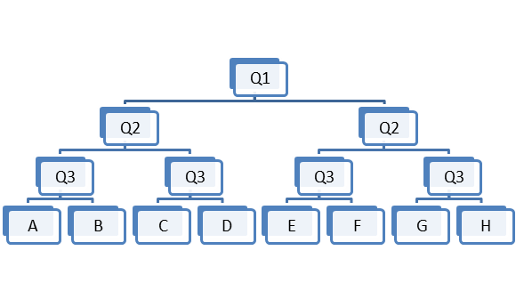
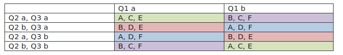

Some people prefer to write and design games “organically” letting the story take you to the next step, but I think it is a cause for many people to finish planning their game. In this article, I will explore borrowing a process to be the outline of a game. Using the GROW mnemonic from coaching conversations; I will explain how to plan a game outline.

 

## Would a game based around a process be interesting and easy to write? ##

The GROW mnemonic for coaching conversations. I thought it would be a good fit, because conversations are like interactive stories. The player is a participant that can form an idea from what they understand, help form ideas and then make a decision on how to complete the story.

The GROW method has 4 steps:

1.       Goals                - what do you want?

2.       Reality              - where are you now?

3.       Options              - what could you do?

4.       Wrap Up              - what will you do?

GROW is meant to be used by coaches to drive a coaching conversation, and help the coached person build self-awareness, think statically, and develop ownership of a problem. So I think it has potential to suit a game.

## Goals as exposition ##

The game could open with explaining the goal, in an exposition.

Maybe the power went out, and you need to get it working again.

 

## Then the player explores the Reality ##

This could be them forming an idea of how the problem came about (in the players head), or some exploration to understand the situation.

Exploring could be going to the Plant room to see the generator has failed, talking to another technician to learn it is just your section without power.

 

## Playing out the Options ##

We then have the coach recap and ask 3 questions, that depending on the answer gives 8 options.

Another way would be to Ask 3 questions. Then compare the answers against each other (Q1&Q2, Q2&Q3, Q1&Q3) to create 6 options, displayed in 4 different groups of options.

I prefer this way, because it allows the character to discuss and form ideas, then choose from those ideas.

If we wanted to add the other two options, we could unlock them after a first play through, or add them to the cases where all three answers were equal.

With the power out situation, you could be talking with the repair team about your priorities and possible solutions. 1. Would you connect to the grid, then start the generator, or start the generator then connect to the grid? 2. If the generator does not start, will you check the starter or fuel first? 3. When bringing everything online, do you start the computer server or air conditioning first? (These questions should be more independent, but they are choices the player can discuss to generate options).

 

## Wrap Up ##

The player makes a decision from the Options and the game continues, implementing the solution chosen. Maybe I should then have a fifth step of Implementing. Sticking to the 4 steps, we then continue the story and have a decision or two to confirm the player is following their plan.

In our power plant example, they have an option to turn the server on first even if they decided to turn the air conditioning on first. This can then cause the rest of the repair team to get angry, or not solve the problem before the battery goes flat.

 

## Conclusion ##

The GROW process is somewhat similar to the 3 act structure of Setup, Confrontation and Resolution. With the Goal and Reality steps being the Setup, Options as the confrontation and Wrap Up as resolution.

I found that by having an outline, helped me think about the gameplay and flow a little bit more. Using the GROW mnemonic was more familiar to me, than the story theory of Act I, Act II, Act III. Also the Options step kept me focused on what the core decision the player makes will be – I knew the decision on how to repair the generator was key, not if you went North or South, or put Sugar in your tea was what solved the problem and won the game.

To expand or fatten out the game, I could make a second iteration of GROW, for the next hurdle in the game.

 

## Extra points ##

You could attempt to use another decision model ([wikipedia article](https://en.wikipedia.org/wiki/Decision_cycle)) to form the outline of your story.
