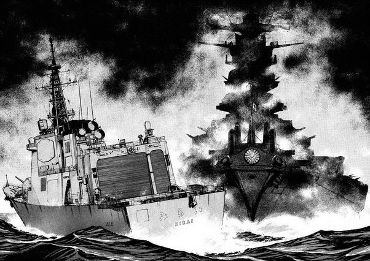
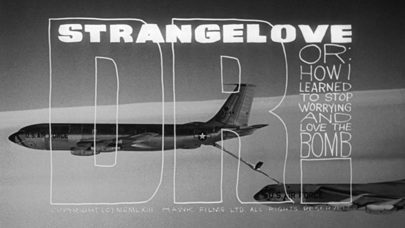

. I only had a demo version that came with our PackardBell-486. But it got me interested in simulations, and there was at least three ways I could sink my boat. 

I wanted to make a similar simulation, where you are the captain of a warship.

To fit into the [Gentle Ghost game Jam](https://itch.io/jam/gentle-ghost-jam)- where the goal is " make a game about ghosts where horror isn't the main genre." I figured I could make my game about encountering a ghost ship, so the main genre is still simulator.

What if instead of a modern ship slipping back in time, a ship from WW2 appeared (like a [flying duchman](https://en.wikipedia.org/wiki/Flying_Dutchman)) and was intercepted by a modern warship.

## Developing my idea ##

I figured that to introduce the game, I woul need to set the scene, and I could do that with an opening sequence of Replenishment at Sea.

Similar to Air-Air refueling, your ship will be running low on fuel and need to connect up to a tanker and refuel.
This would introduce that you are the captain, and give the player a few decisions to get use to command.

## Choosing a Ghost Ship ##

For the Ghost ship, at first I was going to choose a coal-powered ship from the late 19th century. But researching I found there wasn't a lot of information.

I then came across a paper about [Degrees of Readiness](http://www.defence.gov.au/sydneyii/FinalReport/Report/Chapter%206.pdf) that reviews how Cruisers in early WW2 went to action stations. And decided that with so much materiel on HMAS Sydney, it would be a good ship to be the Ghost Ship.

Some other sources were:
* [RAN history pages](http://www.navy.gov.au/hmas-sydney-ii-part-2), that also has many photos for the sketches of ship and crew
* [NAA sinking of Sydney](http://guides.naa.gov.au/sinking-of-hmas-sydney/index.aspx) that explains a lot of the November 1941 disapearance and what occured around it.
* [Wikipedia](https://en.wikipedia.org/wiki/HMAS_Sydney_%28D48%29)
* [WA Museum](http://museum.wa.gov.au/explore/sydney)
* [Gunplot story](http://www.gunplot.net/main/content/how-we-killed-men-hmas-sydney) that explains an account of how the Sydney was sunk.

So then, I figured the game would have to take place in the Indian Ocean.

## The fictitious warship ##

There are a lot of sources for information about how modern warships are run. Most NATO procedures are open source and can be downloaded (do your own search for ATP-16.1 for RAS information). But, then I thought it would be not very fun if you have to do things by the book - and would require me to copy a lot of procedures into the game (or suplimentary materiel) to help the player.

I checked if HMAS Matilda was a real ship. Because it would be punny to say "Let's Waltz this ship", checking Google, Bing etc. was promising and [Wikipedia](https://en.wikipedia.org/wiki/HMS_Matilda) only showed 2 HMS ships from the 18th and 19th century by that name (both captured French ships).

Both HMS Matilda's being French, got me interested that maybe a French designed ship would be named [HMAS](https://en.wikipedia.org/wiki/Her_Majesty%27s_Australian_Ship) Matilda.

Looking at Wikipedia, a modern Frigate would be out-run, out-gunned and out-numbered by the WWII cruiser. But the modern ship would have better situational awareness, connectivity to internet etc. that may be an advantage.

A gun fight is unlikely, but an interesting dialogue Captain-Captain or boarding party to crew could occur.
