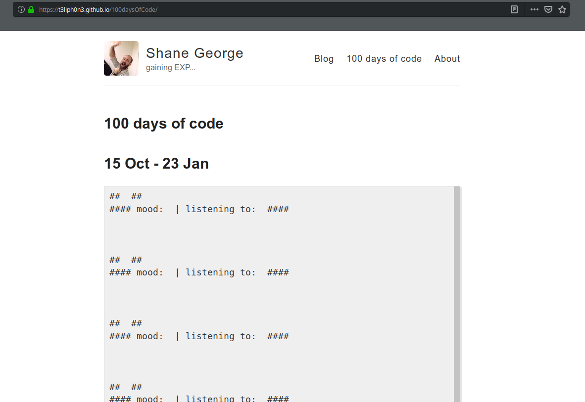

Today I started coding at 7am after a jog, and my hour was really a Jekyll-Now headache...

* I tried to make a new layout in _layouts, and setting the layout to the new layout. It causes the page to not be rendered.
* I tried to make a [category](https://jekyllrb.com/docs/collections/), and it didn't process, and the page I made to pull them was a mess. 

* I then kept on trying to read and find a way for categories to work.
* Then I noticed I could use categories in _posts, I found this code snippet
```

  <h3>{{ category[0] }}</h3>
  <ul>
    
      <li><a href="{{ post.url }}">{{ post.title }}</a></li>
    
  </ul>

```
* So by making my r2dX posts a category **100daysOfCode** I can then have them displayed on my 100days.md page with the above code.

* At 9:30 I quickly updated my bash script for generating the header of these 100DayOfCode posts, and wrote this post.
