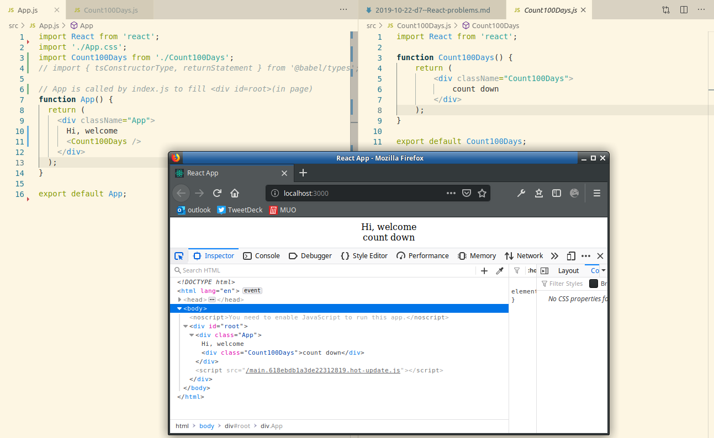
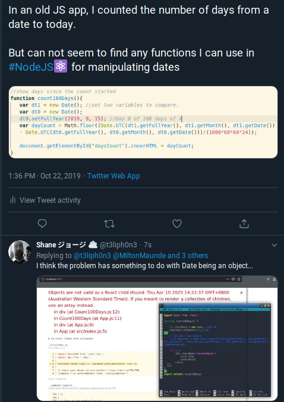
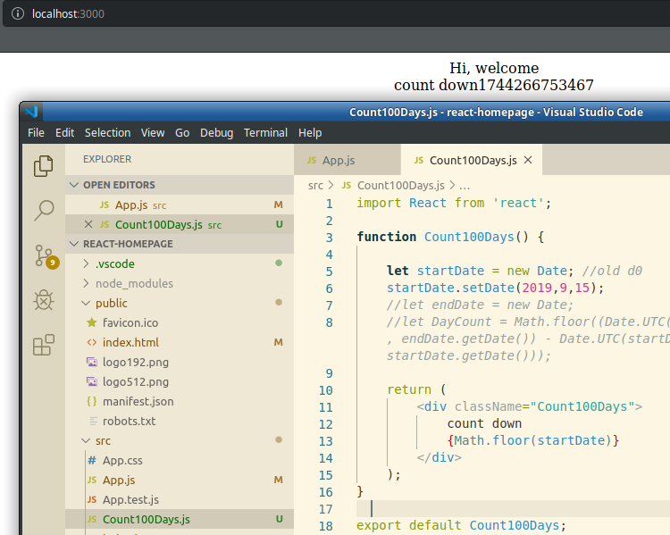
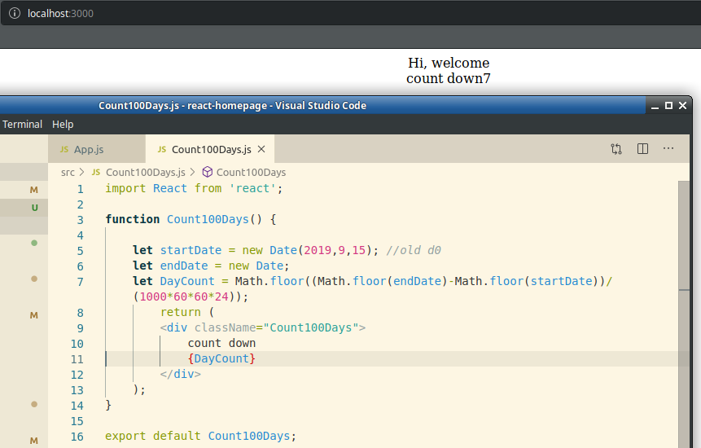

Today I am trying to get React to work. At first I couldn't figure out how to get elements rendered, or what logic to use to conver a JS script filling the DOM with _getElementById_ to React single page.

# 1. Elements not working as I expected #

I have simply split my App() into two sections in my App.js:
```
function App() {
  return (
    <div className="App">
      Hi, welcome.
      <count100Days />
    </div>
  );
}

function count100Days() {
  return (
    <div className="count100Days">
      <b> count down</b>
    </div>
  );
}
```

But in the body of my HTML is:
```
<div id="root">
    <div id="App">
        Hi, welcome.
        <count100Days></count100Days>
    </div>
</div>
```
I would expect the words count down to be in the count100Days tag.

## Getting Elements to work ##

To fix this, I put **Count100Days** in it's own file _Count100Days.js_.
> import './Count100Days'
* This caused an error "Count100Days not defined..."
* After a long while, and many tests I figured out it was becasue I needed to put
> import Count100Days from './Count100Days'

So now my code works at passing the 2nd element into the first. It looks like:



# 2. Converting getElementById to ReactJS style: #

A while ago I built [Organiser](https://github.com/t3liph0n3/Calendar/blob/master/organiser.js), what is really a neat looking calendar with today highlighted. I am unsure how to migrate it.

What should I do to change:
> document.getElementById("daysCount").innerHTML = dayCount; 
to something that works in ReactJS?

At first I was getting object errors and I was getting somewhat silly ideas from sites like [this](https://www.tutorialsplane.com/reactjs-get-current-date-time/) that suggested using var and other things that do not work on single page ReactJS.

I shot off a twitter request, and some screenshots explaining how it was causing issues.
In the ReactJS Dev page, I found something about [dart methods](https://dev.to/graphicbeacon/top-7-date-methods-you-should-know-dart-2ap0). I think this may be something a little different to ReactJS.

By chance I noticed the problem wasn't happening when I used **Math.floor()**

So I figured it out, and then just needed to find the maths to convert the seconds to days
> divide by (1000*60*60*24)
incase you are wondering gets days. To get whole days use **Math.floor()** again, and presto...

It counts days.

I think the hardest part was a few syntax errors and only coding for 20 or 30 min here and there through the day. ReactJS  stops a lot of methods that I wanted to use (**.UTC**, **.setFullYear** etc.) that So it was 3pm when I figured out the solution.

### I am still unsure if I should use let or const, for these lines in my method. Or if it is the wrong tact all together ###