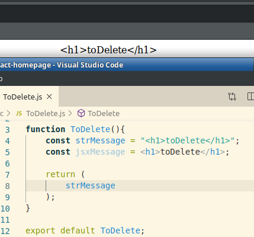
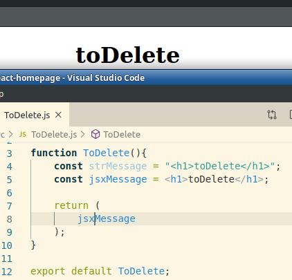
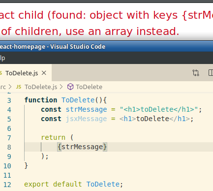

This morning, I discovered you can have variables that contain JSX.

There were also some errors when I tried to parse half a tag, ie. an element on a table without the table tags
and I am unsure how to append to the JSX variable, ie. start with the opening tag, iterate through contents then close with closing tag