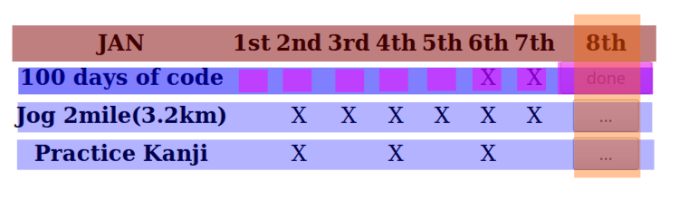

procrastination

https://tvtropes.org/pmwiki/pmwiki.php/Main/HeroicBSOD

https://magikonline.com/chapter1mymagicalapp/ an online story about Magiteck (being able to buy spells online).

After than I decided to do some [ReactJS planning](https://reactjs.org/docs/thinking-in-react.html) work and make a Habiter.
That is sort of a calendar where you check off the days you do something, and have streaks.

I started with the check-off part, written in JSX as the return from the component.

My components are:
* heading row
* rows of habits
    * each day in month (highlighted if task was completed)
    * today special as it has button for done/skipped/waiting
* ? maybe today is a special heading ?