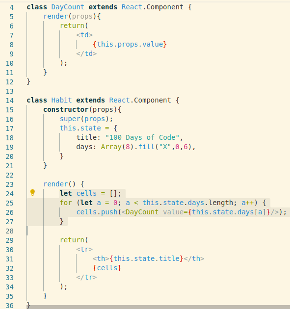

Today I tried to get my Habit tracket filled out.

Not year yet, but I have learnt how I can impliment:

### Filling Array ###
https://developer.mozilla.org/en-US/docs/Web/JavaScript/Reference/Global_Objects/Array/fill

> Array.fill(x,y,z);


### Recursion ###
I finally figured out how to avoid lines and lines of code to make tables etc.

Reading, https://stackoverflow.com/questions/39462458/react-js-creating-simple-table#39476856
```
    let rows = [];
    for (var i = 0; i < this.state.size; i++){
      let rowID = `row${i}`
      let cell = []
      for (var idx = 0; idx < this.state.size; idx++){
        let cellID = `cell${i}-${idx}`
        cell.push(<td key={cellID} id={cellID}></td>)
      }
      rows.push(<tr key={i} id={rowID}>{cell}</tr>)
    }
```

I eventually figured out I could, fill an array with JSX and use it to populate the page.


Rather than having lines and lines of
<DayCount value=x>

# I am also: #
Working on writing a game in Renpy.
Yesterday I started using Inkscape to draw some background images...
https://twitter.com/t3liph0n3/status/1190422154216525826